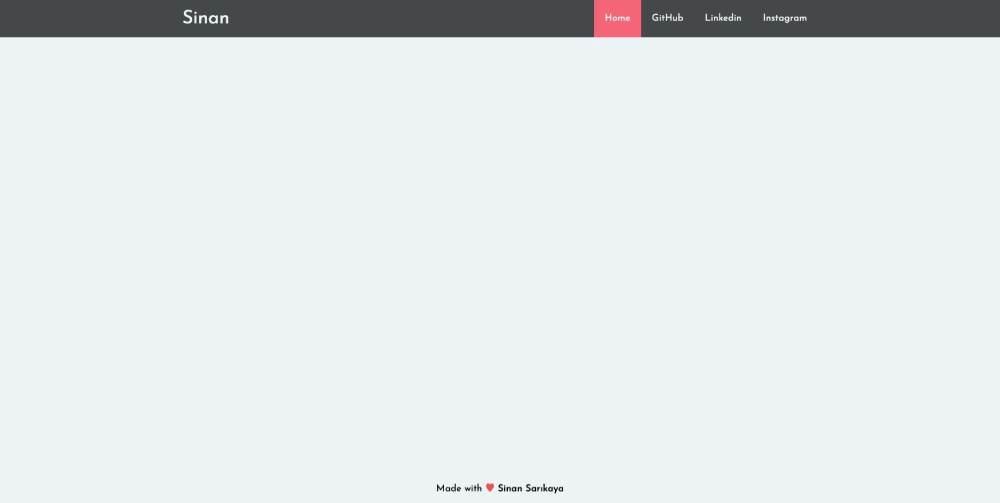

# Responsive JavaScript Navbar


### Responsive hamburger navbar made using JavaScript

<hr />

## Installation Options

```
$ git clone https://github.com/sinansarikaya/JavaScript-Responsive-Navbar.git
```

<hr />

## Demo Desktop



<hr />

## Demo Responsive


